Alvera-Azcárate, A., C. Troupin, A. Barth, and J.-M. Beckers. 2011.
“Comparison Between Satellite and in Situ Sea Surface Temperature Data
in the Western Mediterranean Sea.” *Ocean Dynamics* 61 (6): 767–78.
doi:[10.1007/s10236-011-0403-x](https://doi.org/10.1007/s10236-011-0403-x).

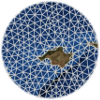
Barth, A., A. Alvera-Azcárate, C. Troupin, M. Ouberdous, and J.-M.
Beckers. 2010. “A web interface for griding arbitrarily distributed in
situ data based on Data-Interpolating Variational Analysis (DIVA).”
*Advances in Geosciences* 28: 29–37.
doi:[10.5194/adgeo-28-29-2010](https://doi.org/10.5194/adgeo-28-29-2010).

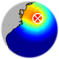
Barth, A., J.-M. Beckers, C. Troupin, A. Alvera-Azcárate, and L.
Vandenbulcke. 2014. “Divand-1.0: N-Dimensional Variational Data Analysis
for Ocean Observations.” *Geoscientific Model Development* 7: 225–41.
doi:[10.5194/gmd-7-225-2014](https://doi.org/10.5194/gmd-7-225-2014).

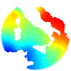
Beckers, J.-M., A. Barth, C. Troupin, and A. Alvera-Azcárate. 2014.
“Some approximate and efficient methods to assess error fields in
spatial gridding with DIVA (Data Interpolating Variational Analysis).”
*Journal of Atmospheric and Oceanic Technology* 31 (2): 515–30.
doi:[10.1175/JTECH-D-13-00130.1](https://doi.org/10.1175/JTECH-D-13-00130.1).

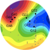
Benavides, M., J. Arístegui, N. S. R. Agawin, X. A. Álvarez-Salgado,
M. Álvarez, and C. Troupin. 2013. “Low contribution of N2 fixation to
new production and excess nitrogen in the subtropical northeast Atlantic
margin.” *Deep-Sea Research I* 81 (0): 36–48.
doi:[10.1016/j.dsr.2013.07.004](https://doi.org/10.1016/j.dsr.2013.07.004).

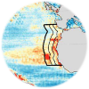
Capet, A., E. Mason, V. Rossi, C. Troupin, Y. Faugère, I. Pujol, and A.
Pascual. 2014. “Implications of refined altimetry on estimates of
mesoscale activity and eddy-driven offshore transport in the Eastern
Boundary Upwelling Systems.” *Geophysical Research Letters* 41 (21):
7602–10.
doi:[10.1002/2014GL061770](https://doi.org/10.1002/2014GL061770).

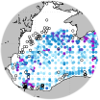
Capet, A., C. Troupin, J. Carstensen, M. Grégoire, and J.-M. Beckers. 2014. “Untangling spatial and temporal trends in the variability of the
Black Sea Cold Intermediate Layer and mixed Layer Depth using the DIVA
detrending procedure.” *Ocean Dynamics* 64 (3): 315–24.
doi:[10.1007/s10236-013-0683-4](https://doi.org/10.1007/s10236-013-0683-4).

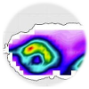
Juza, M., R. Escudier, A. Pascual, M.-I. Pujol,
G. Taburet, C. Troupin, B. Mourre, and J.
Tintoré. 2016. “Impacts of reprocessed altimetry on the surface
circulation and variability of the Western Alboran Gyre.” *Advances in
Space Research* 58 (3): 277–88.
doi:[10.1016/j.asr.2016.05.026](https://doi.org/10.1016/j.asr.2016.05.026).

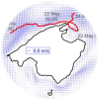
Juza, M., B. Mourre, L. Renault, S. Gómara, K. Sebastián, S. Lora, J. P.
Beltran, et al. 2016. “SOCIB operational ocean forecasting system and
multi-platform validation in the Western Mediterranean Sea.” *Journal of
Operational Oceanography* 9 (sup1): s155–s166.
doi:[10.1080/1755876X.2015.1117764](https://doi.org/10.1080/1755876X.2015.1117764).

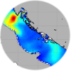
Lenartz, F., J.-M. Beckers, J. Chiggiato, B. Mourre, C. Troupin, L.
Vandenbulcke, and M. Rixen. 2010. “Super-Ensemble Techniques Applied to
Wave Forecast: Performance and Limitations.” *Ocean Science* 6 (2):
595–604.
doi:[10.5194/os-6-595-2010](https://doi.org/10.5194/os-6-595-2010).

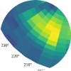
Licer, M., B. Mourre, C. Troupin, A. Krietemeyer,
A. Jansá, and J. Tintoré. 2017. “Numerical Study of Balearic
Meteotsunami Generation and Propagation Under Synthetic Gravity Wave
Forcing.” *Ocean Modelling* 111 (Mar). Elsevier BV: 38–45.
doi:[10.1016/j.ocemod.2017.02.001](https://doi.org/10.1016/j.ocemod.2017.02.001).

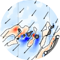
Mason, E., F. Colas, J. Molemaker, A. F. Shchepetkin, C. Troupin, J. C.
McWilliams, and P. Sangrà. 2011. “Seasonal Variability of the Canary
Current: A Numerical Study.” *Journal of Geophysical Research* 116 (C6):
C06001.
doi:[10.1029/2010JC006665](https://doi.org/10.1029/2010JC006665).

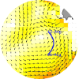
Pascual, A., A. Lana, C. Troupin, S. Ruiz, Y. Faugère, R. Escudier, and
J. Tintoré. 2015. “Assessing SARAL/AltiKa near-real time data in the
coastal zone: comparisons with HF radar and Jason-2 observations.”
*Marine Geodesy* 38 (Supplement 1): 260–76.
doi:[10.1080/01490419.2015.1019656](https://doi.org/10.1080/01490419.2015.1019656).

Pascual, A., S. Ruiz, A. Olita, C. Troupin, M.
Claret, B. Casas, B. Mourre, et al. 2017. “A multiplatform
experiment to unravel meso- and submesoscale processes in an intense
front (AlborEx).” *Frontiers in Marine Science* 4 (39): 1–16.
doi:[10.3389/fmars.2017.00039](https://doi.org/10.3389/fmars.2017.00039).

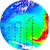
Sangrà, P., C. Troupin, B. Barreiro-González, E. D.
Barton, A. Orbi, and J. Arístegui. 2015. “The Cape Ghir
filament system in August 2009 (NW Africa).” *Journal of Geophysical
Research* 120 (6). Wiley-Blackwell: 4516–33.
doi:[10.1002/2014jc010514](https://doi.org/10.1002/2014jc010514).

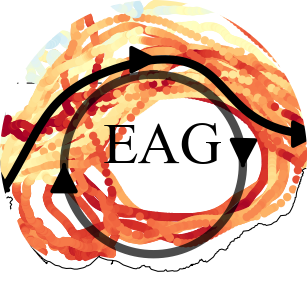
Sotillo, M.G., E. Garcia-Ladona, A. Orfila, P. Rodríguez-Rubio, J. C.
Maraver, D. Conti, E. Padorno, et al. 2016. “The MEDESS-GIB database:
Tracking the Atlantic water inflow.” *Earth System Science Data* 8:
141–49.
doi:[10.5194/essd-8-141-2016](https://doi.org/10.5194/essd-8-141-2016).

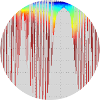
Troupin, C., J.P. Beltran, E. Heslop, M Torner, B. Garau, J. Allen, S.
Ruiz, and J. Tintoré. 2015. “A toolbox for glider data processing and
management.” *Methods in Oceanography* 13-14: 13–23.
doi:[10.1016/j.mio.2016.01.001](https://doi.org/10.1016/j.mio.2016.01.001).

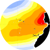 
Troupin, C., F. Machín, M. Ouberdous, D. Sirjacobs, A. Barth, and J.-M.
Beckers. 2010. “High-Resolution Climatology of the North-East Atlantic
Using Data-Interpolating Variational Analysis (Diva).” *Journal of
Geophysical Research* 115 (C8): C08005.
doi:[10.1029/2009JC005512](https://doi.org/10.1029/2009JC005512).

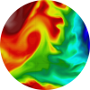 Troupin, C., E. Mason, J.-M. Beckers, and P. Sangrà. 2012. “Generation
of the Cape Ghir Upwelling Filament: A Numerical Study.” *Ocean Modelling* 41: 1–15. doi:[10.1016/j.ocemod.2011.09.001](https://doi.org/10.1016/j.ocemod.2011.09.001).

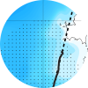 Troupin, C., A. Pascual, G. Valladeau, I. Pujol, A. Lana, E. Heslop, S.
Ruiz, M. Torner, N. Picot, and J. Tintoré. 2015. “Illustration of the emerging capabilities of SARAL/AltiKa in the coastal zone using a multi-platform approach.” 
*Advances in Space Research* 55 (1): 51–59. doi:[10.1016/j.asr.2014.09.011](https://doi.org/10.1016/j.asr.2014.09.011). 

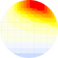 Troupin, C., P. Sangrà, and J. Arístegui. 2010. “Seasonal variability of
the oceanic upper layer and its modulation of biological cycles in the
Canary Island region.” *Journal of Marine Systems* 80 (3-4): 172–83.
doi:[10.1016/j.jmarsys.2009.10.007](https://doi.org/10.1016/j.jmarsys.2009.10.007).

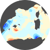 Troupin, C., D. Sirjacobs, M. Rixen, P. Brasseur, J.-M. Brankart, A.
Barth, A. Alvera-Azcárate, et al. 2012. “Generation of analysis and
consistent error fields using the Data Interpolating Variational
Analysis (Diva).” *Ocean Modelling* 52-53: 90–101.
doi:[10.1016/j.ocemod.2012.05.002](https://doi.org/10.1016/j.ocemod.2012.05.002).

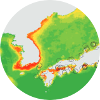 Tyberghein, L., H. Verbruggen, K. Pauly, C. Troupin, F. Mineur, and O.
De Clerck. 2012. “ORACLE: A Global Environmental Dataset for Marine
Species Distribution Modeling.” *Global Ecology and Biogeography* 21
(2): 272–81.
doi:[10.1111/j.1466-8238.2011.00656.x](https://doi.org/10.1111/j.1466-8238.2011.00656.x).

### Hidden gems

Sometimes people say "*if it's not published, it doesn't exist*". Here are a few [pieces of work](./publications/unpublished.md) that will maybe never published.

