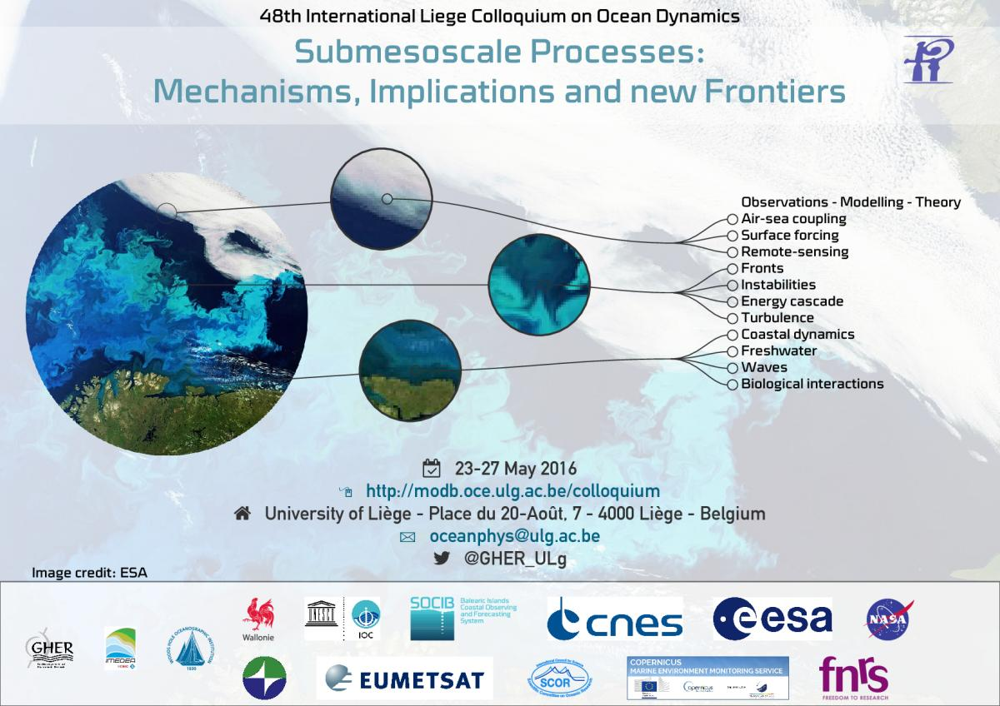
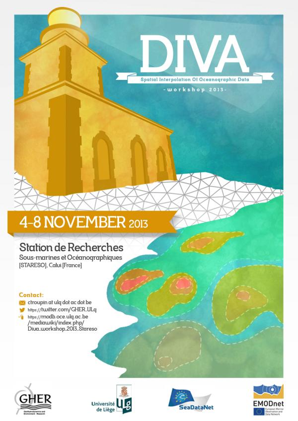

## Conference Flyers

### 48th Liège Colloquium on Ocean Dynamics

The objective was to create clean and modern flyer for that edition of the Colloquium
focused on *Submesoscale Processes*.

#### Concept 
The left-hand side illustration is a satellite image showing sub-mesoscale feature on the sea surface. 
Three circular spots are enlarged to provide a higher-resolution view of the features, with the underlying idea of highlighting the multi-scale nature of the ocean dynamics.
Finally, each of the enlarged illustrations are linked to the 12 main conference topics.    

{:target="_blank"}

#### Realisation
The flyer was created with the [LaTeX](https://www.latex-project.org/) typesetting system.
The reason for this choice was the need for flexibility and the possibility to instantaneously update the document 
as soon as a new sponsor was added or when information concerning the deadlines were edited.    
Main packages: [tikz](https://www.ctan.org/pkg/pgf) for the lines joining the different objects and for the magnifying glass effect, 
[marvosym](https://www.ctan.org/pkg/marvosym) and [fontawesome](https://www.ctan.org/pkg/fontawesome) for the icons.    

### Diva User Workshop 2013

The flyer was designed by the outstanding Javier Rodríguez from [Diestro&Siniestro](http://www.diestroysiniestro.com/) studio.
An efficient design mixing the venue architecture (a lighthouse) and more technical elements, fruit of a discussion where we 
explained our needs and provided the main ideas.

#### Concept

Technical elements (finite-element mesh, iso-value contours, colored surfaces) were combined 
with a textured version of the [*Revellata Lighthouse*](https://www.flickr.com/photos/sharlo1982/34845053842/) located close to the
workshop venue and used as the participant accommodation.

#### Realisation

The lighthouse was created from a real picture taken during a previous edition of the workshop. 
The triangular element mesh was generated by the [Diva](https://github.com/gher-ulg/diva) interpolation tool. 
