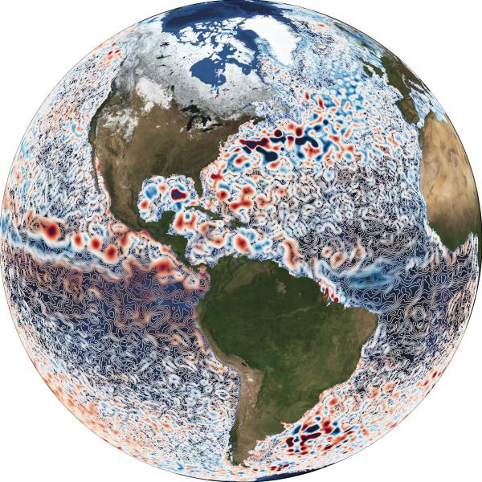

For over 10 years I have been creating figures for scientific publications 
and more recently I have designed conference flyers.

## Scientific illustration

Since the beginning of my career I have always paid attention to the details
of the graphical material we had to produce for peer-reviewed publications, posters or presentations.
Looking back at my first creations, I am glad to observe a continuous improvement and the development of
a capacity to properly convey a message through a figure or an animation.

From 2015 to 2016, I was responsible for the creation of graphical material for the [In Situ component](https://github.com/CopernicusMarineInsitu/INSTACTraining) of the Copernicus Marine Environment Monitoring Service ([CMEMS](http://marine.copernicus.eu/)).

Click on the figure to see other examples.

<figure>

</figure> 

## Conference flyers

The most recent examples are available [here](flyers.html).

