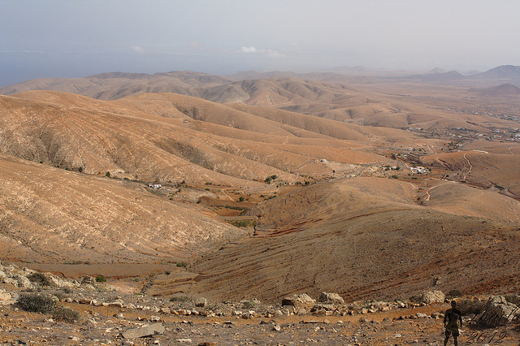

### Canary Island population

Some days ago with some friend, we were asking ourselves about the population of
the various municipalities in Gran Canaria, then the Canary Islands. It was not
too difficult to find the answer but we needed something more visual and also
a quicker way to find the population of a given place.



  

**Solution?** Create a [choropleth](https://en.wikipedia.org/wiki/Choropleth_map) map using [Leaflet](http://leafletjs.com/) library. To do so, we just had to combine the
population data obtained from the [Instituto National de Estadística](http://www.ine.es/) and the municipality geographical limits from the [Centro National de Información Geográfica](http://centrodedescargas.cnig.es). The result is a [geoJSON](http://geojson.org/) file
in which each feature (i.e. each municipality) has a *habitants* property that is used
to style the choropleth map.

**Just for fun:** [Betancuria](https://www.aytobetancuria.org/en/) (Fuertenventura) is the least populated municipality in the Canary Islands, with around 700 people.

  

