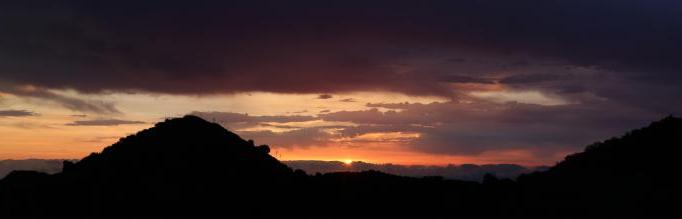

### Photography

I started photography with a compact camera in 2006 when I was in Gran Canaria during an ERASMUS exchange and my first reflex was in 2008.

My feeling is that a good picture is about being at the right place and the right time, not spending minutes (or hours) with the editing software or using the instagram filters.

Landscape photography is what I enjoy the most, because it allows me to combine it with hiking and sometimes running.

I must admit my Instagram is not updated for several months. I believe Instagram is meant to use with unprocessed pictures taken with a smartphone, so as I don't have a smartphone anymore and don't want to upload other pictures, that one is done!
