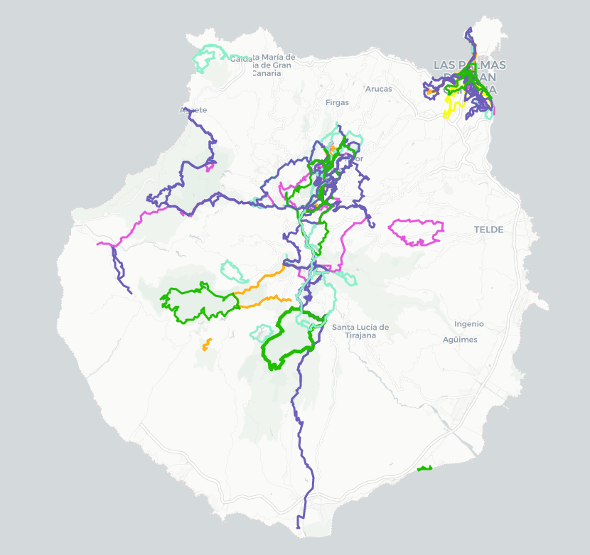

## Trail running

I started trail-running in Gran Canaria. It comes naturally: after I explored part of the island walking, one day I though: ok, let's do the same running. 
The direct benefit is that you can see much more in the same amount of time, at the cost of being a little bit more tired.

Now I try to run everywhere I go. Not only can I discover new places and tracks, but also I made several friends that share the same passion for the sport. 

## Past races

### 2017

**[TransGranCanaria](https://ctroupin.wordpress.com/2017/02/27/crossing-gran-canaria/)**, Gran Canaria, 125 km. The longest race I did. The motivation dates back to 2007 or 2008, when I saw finishers along *Las Canteras* beach in Las Palmas. 
I skipped it for many years because of the registration cost, finally I did it because of my attachement to the island.

### 2016

**[Mallorca K42](https://www.wikiloc.com/wikiloc/view.do?id=12641760)**, Mallorca, 44 km. Probably the least pleasant race I had. The first 20 km or so were cool, in the mountains, then back at the starting point we had to follow a dry stream, then back on the road almost until the finish line. The bus from the organisation took us to the starting line way too long in advance, so we could simply do nothing for 2 hours.

### 2015

**[TransVulcania](https://ctroupin.wordpress.com/2015/05/13/de-fuencaliente-a-los-llanos-de-aridane-transvulcania-2015/)**, La Palma: 3rd participation to that race, and the edition for which I had the best preparation. A lot of good sensations, until the top of the island, the Roque de los Muchachos. The rest was painful but what matters is to finish. Again: the best public one can have. I really really have to do it again, I need a revenge.

**[Tomir 42](https://ctroupin.wordpress.com/2015/03/29/running-in-pollenca-the-tomir42-race/)**, Pollença, Mallorca: I knew about the race beforehand and really felt I had to give it a try. The distance is reasonable but the elevation (> 2000 m) and the technical parts make it a tough race. 

**Maratón de les muntanyes d’Artà**: I enjoyed the previous edition so participating again was almost mandatory. Good feelings during the 4 hours 37 minutes of race. I thought it was my best time for a marathon (I never tried a flat one), unfortunately we were slightly below the 42 km. 

### 2014

**[Utra Tramuntana](https://ctroupin.wordpress.com/2014/04/21/crossed-mallorca/)**, Mallorca, 112 km: crossing an island from side to side is always something fun and symbolic: it's you against the hills. I missed the registration for the 2013 edition so I had time to be well prepared for that one. The goal was to cross the finish line in about 18 hours, it took me one hour more. After the race I was sure I didn't want to repeat, not for the difficulty, but rather for the route (boring roads) and for the race atmosphere.

**[Maratón de les muntanyes d’Artà](https://ctroupin.wordpress.com/2014/11/05/maraton-de-muntanyes-darta/)**, Artà, Mallorca: nice distance inside of quite remote place in the island: the *Parc Natural de la Peninsula del Llevant*. The race I enjoyed the most during the time I spent on the island. 

### 2013

**TransVulcania** (2nd time): a good training program while living in Mallorca helped me improve my time and condition. Still hard to properly run the long descent from Roque de los Muchachos to Tazacorte. The greatest public, once again!

### 2012

**Trail des Crêtes de Spa**: I had a mixed success in my participations to the classical 21 km in Spa and I decided to try the 1st edition of that trail. Lot of fun, good legs, cool atmosphere, even with that I did not repeat.

### 2011

**Grand Trail des Lacs et Chateaux**: why not a race a few kilometers from home? 18 km on Saturday and then 45 on Sunday, a nice experience to re-discover my own region. I'm not sure why I didn't try longer distances that year. 

### 2010

**TransVulcania**, La Palma, 73 km: often considered as the hardest race in the islands, the Transvulcania is now famous around the world. In 2010 for the 2nd edition we were very few to challenge the insane elevation profile of La Palma. The training was better than for the Challenger, but still very basic. The day after the race I said that it was the biggest effort I did in my life.

### 2009

**Gran Canaria Challenger**, Gran Canaria: it's funny to think that my first trail ever was a race of 75 km. I'm not sure how I did to finish with this zero experience in training. The first part until the top of the island was not too bad, then going down to sea level was painful in the end. We dit it!

